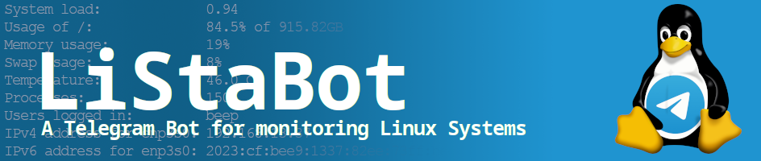

<div align="center">


[](https://github.com/beep-projects/LiStaBot/blob/main/LICENSE) [](https://github.com/beep-projects/LiStaBot/actions/workflows/shellcheck.yml) [](https://github.com/beep-projects/SystaPi/issues) [](https://github.com/beep-projects/LiStaBot/network) [](https://github.com/beep-projects/LiStaBot/stargazers)  [](https://github.com/beep-projects/LiStaBot/) [](https://github.com/beep-projects/LiStaBot/) [](https://github.com/beep-projects/LiStaBot/) [](https://github.com/beep-projects/LiStaBot/) [](https://github.com/beep-projects/LiStaBot/) [](https://visitorbadge.io/status?path=beep-projects%2FLiStaBot)

</div>

# LiStaBot

Telegram Bot for monitoring a Linux system. 

You can set limits for disk usage, RAM usage and CPU load. The bot will notify you if a limit is breached. The project has three main components

```lista.sh```:
A shell script, that can also be used as standalone tool, to retrieve status information about the system

```lista_watchdog.sh```:
The watchdog script using ```lista.sh``` to monitor the alert limit and send alerts via [telegram.bot](https://github.com/beep-projects/telegram.bot)

```lista_bot.sh```:
A shell script used to provide you access via Telegram to the configuration of ```lista_watchdog.sh``` and queries from ```lista.sh```

## Content

- [Project Requirements](#project-requirements)
- [Project Files](#project-files)
- [Installation](#installation)
  - [Setup a Telegram bot](#setup-a-telegram-bot)
  - [Run the script](#run-the-script)
- [LiStaBot Commands](#listabot-commands)

## <a name="project-requirements"/>Project Requirements

The scripts are developed and tested on bash shell. Following tools (excluding Linux build ins) are used inside the scripts, most of these should be part of any common Linux distribution. The tools that might be missing on your system are most likely  ```jq```, ```mpstat```, or ```wget```:

- ```awk``` (POSIX)
- ```cut``` (GNU core utils)
- ```df``` (GNU core utils)
- ```free``` (procps-ng)
- ```grep``` (POSIX)
- ```jq```
- ```mpstat``` (sysstat)
- ```paste``` (GNU core utils)
- ```ps``` (POSIX)
- ```tail``` (POSIX)
- ```telegram.bot``` (installed if not available)
- ```users``` (GNU core utils)
- ```wget```


## <a name="project-files"/>Project Files
```
    ├── resources               # folder to store files used for README.md
    ├── install_lista.sh        # script to install lista.sh, lista_watchdog.service and lista_bot.service
    ├── LICENSE                 # license for using and editing this software
    ├── lista.sh                # script to get some system information
    ├── lista_bot.service       # service to configure lista_watchdog.service via Telegram
    ├── lista_bot.sh            # shell script started by lista_bot.service
    ├── lista_watchdog.service  # service for priodically checking some system limits and sending alerts via Telegram 
    ├── lista_watchdog.sh       # script started by lista_watchdog.service
    ├── listabot.conf           # configuration file used by lista_bot.sh and lista_watchdog.sh
    └── README.md               # This file
```

## <a name="installation"/>Installation

The installation is done using the script ```install_lista.sh```. Before you start the installation process, you need a Telegram API Token for your bot. If you only want to use ```lista.sh```, you can skip this step.

#### <a name="setup-a-telegram-bot"/>Setup a Telegram bot

In order to use the messaging feature, you need a **Telegram** account and the app on a mobile phone. See the instructions for [telegram.bot](https://github.com/beep-projects/telegram.bot#usage) on how to set this up, or search the web. 
An important note is that Telegram bots cannot be made fully private. Everyone can search for it and send messages to it. Therefore **LiStaBot** is designed to communicate only with one Telegram account and ignore messages from everyone else.
After setting up the **Telegram bot** and obtaining your **API Token**, send ```/start``` to your bot. This message will be used to identify you for the bot and configure the chat with your Telegram account.
The script will use the last received ```/start``` command to set the  administrator. So this might fail if you use a bot that was added to a group and other people are sending the command there too, but why should they? You can change the configured administrator later by editing ```/etc/lista/listabot.conf``` on the device, but you have to figure out the needed IDs on your own.

#### <a name="run-the-script"/>Run the script

Installation is done via ```install_lista.sh``` . You can select the following options:

```bash
install.sh: script to install scripts from the LiStaBot project
Main parameters are :
  --lista                install only lista.sh
  --watchdog             install lista.sh and the watchdog
  --bot                  install lista.sh, the watchdog and the bot
  -bt|-token|--bottoken  the telegram API bot token to use, mandatory
                         when installing --bot or --watchdog
Options are :
  -h/-?/--help           display this help and exit
  -cid|--chatid          the chat id to use for sending messages to
  --no-service           install only the selected scripts, but no services
```

1. Download and unzip the latest release file from the project page and open a console in the created directory. 
   
   For this you can run the following commands in a console:

   ```
   version=$(curl -sI https://github.com/beep-projects/LiStaBot/releases/latest | awk -F '/' '/^location/ {print  substr($NF, 1, length($NF)-1)}')
   wget "https://github.com/beep-projects/LiStaBot/archive/refs/tags/${version}.zip"
   unzip "${version}.zip"
   cd "LiStaBot-${version#v}"
   ```
   
2. Run the installation script. Note, during installation of ```--bot``` or ```--watchdog```, the script requires you to send ```/start``` to the created Telegram bot, if you have not already done that.

   ```bash
   chmod 755 install_lista.sh
   # do one of the following
   ./install_lista.sh --lista
   # or
   ./install_lista.sh --watchdog --bottoken 110201543:AAHdqTcvCH1vGWJxfSeofSAs0K5PALDsaw
   # or
   ./install_lista.sh --bot --bottoken 110201543:AAHdqTcvCH1vGWJxfSeofSAs0K5PALDsaw
   ```

3. DONE

## <a name="listabot-commands" />LiStaBot commands

The script `lista_bot.sh` is used for communication between you and your bot. During startup the following commands are registered at @BotFather
<sup>(If you have the chat with your bot open after sending ```/start``` to your bot, you have to exit and reenter the chat to update the commands quick menu in the Telegram app)</sup>

```bash
/status - get system status information
/gcl - get CPU load Top 5
/gru - get RAM usage Top 5
/uptime - send the output of uptime
/df - send the output of df -h
/reboot - reboot server
/shutdown - shutdown server
/restartservice - restart lista_bot.service
/gconf - get the config file
/help - shows this info
```

In addition to the commands in the quick menu, there are more commands available. Commands with parameters cannot be added to the quick menu, so you have to enter them manually. To make your life easier, the all have a three letter short code

```bash
/setdisklimit [VALUE] - set the alert threshold for disk usage to [VALUE] percent. Only integers allowed. 
  Short /sdl
/setcpulimit [VALUE] - set the alert threshold for cpu usage to [VALUE] percent. Only integers allowed.
  Short /scl
/setramlimit [VALUE] - set the alert threshold for ram usage to [VALUE] percent. Only integers allowed.
  Short /srl
/setcheckinterval [VALUE] - set the time interval in which the watchdog checks the limits to [VALUE] seconds.
  Short /sci
/getcpuloadtopx [VALUE1] [VALUE2]- get the [VALUE1] processes causing the highest CPU load. 
  If omitted, [VALUE1] defaults to 5. You can pass [VALUE2] to set the line width of the output.
  [VALUE2] defaults to 120.
  Short /gcl
/getramusagetopx [VALUE1] [VALUE2] - get the [VALUE1] processes having the highest RAM usage.
  If omitted, [VALUE1] defaults to 5. You can pass [VALUE2] to set the line width of the output.
  [VALUE2] defaults to 120.
  Short /gru
```

